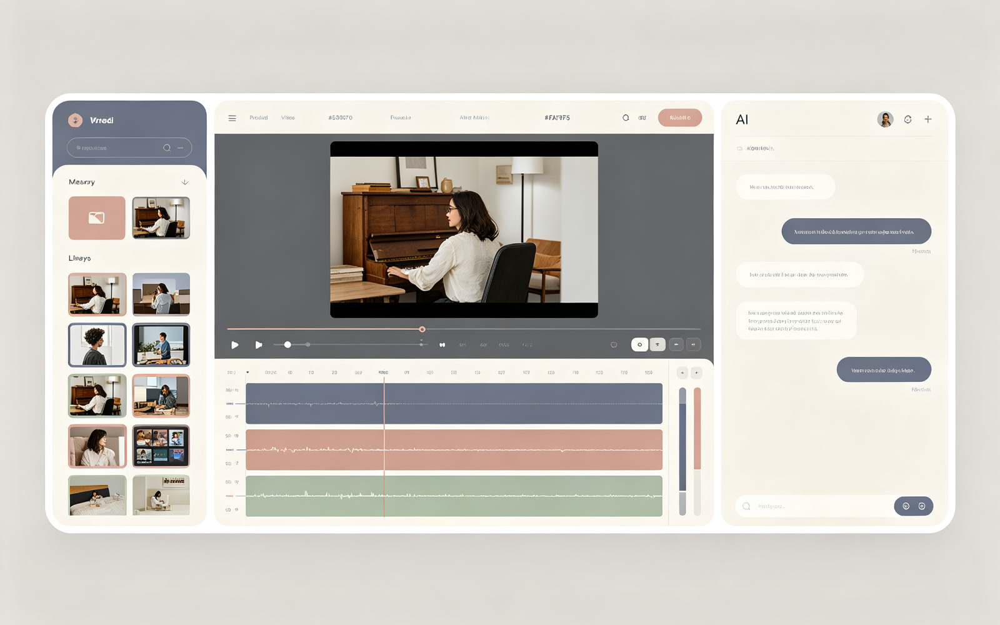
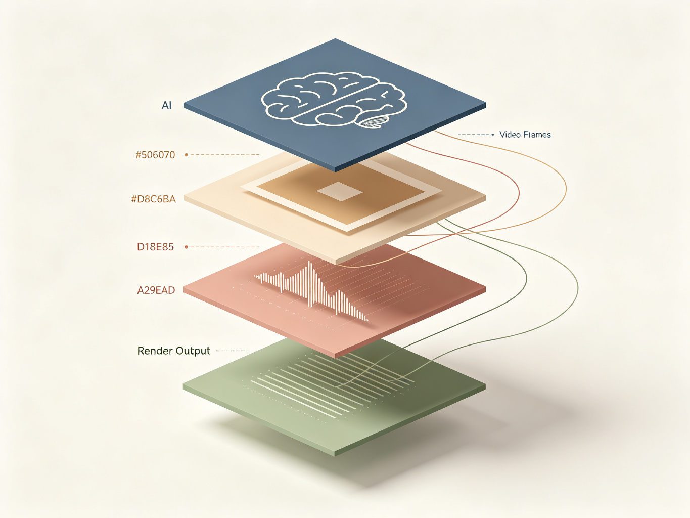

<div align="center">


<br/>

# WeaveClip <sub>CutPilot</sub>

### 🎬 Talk to your footage. Get the video you mean.
### 对着你的素材说话，得到你想要的视频。

<br/>


</div>

---

**WeaveClip（CutPilot）** 是一个 **AI Native 视频剪辑助手**。用自然语言描述你想要的视频效果，AI 自动从原始素材中剪辑、拼接并渲染出成片。

WeaveClip (CutPilot) is an **AI-native video editing assistant**. Describe your vision in plain language — AI automatically selects clips, assembles a timeline, and renders your final video.

<div align="center">

</div>

---

## ✨ Features · 核心特性

<div align="center">

</div>

| 特性 Feature | 说明 Description |
|:---|:---|
| 🤖 **AI 对话式剪辑** | 用自然语言描述意图，AI 自动生成时间线与剪辑方案 <br/> Describe your vision in natural language; AI builds the timeline for you |
| 🎬 **专业多轨时间轴** | 可视化多轨道编辑：视频轨、音频轨、文字轨，精准控制每一帧 <br/> Multi-track timeline: video, audio, and text layers with frame-level control |
| 📤 **智能素材管理** | 自动场景检测、ASR 语音转文字、视觉内容理解，素材自动归档 <br/> Auto scene detection, ASR transcription, and visual understanding |
| ⚡ **实时进度推送** | WebSocket 推送渲染进度，体验流畅不卡顿 <br/> Real-time render progress via WebSocket — smooth and responsive |
| 🔌 **Mock 优先开发** | 后端未就绪时前端全程可用 Mock 数据跑通全流程 <br/> Mock-first architecture: frontend works end-to-end before backend is ready |
| 🎨 **Morandi 设计语言** | 低饱和莫兰迪色板 + Slate Blue 主色，克制专业的编辑器界面 <br/> Low-saturation Morandi palette with Slate Blue accent — clean, professional, tool-like |

---

## 🏗 Architecture · 技术架构

<div align="center">

</div>

### 🖥 Frontend · 前端

| Technology | Purpose |
|:---|:---|
| **React 18 + TypeScript** | Component framework |
| **Vite** | Build tool & dev server |
| **Semi Design** | Enterprise UI component library |
| **CSS Modules** | Style isolation, strict design-token compliance |
| **Zustand** | Client state (timeline, selection, playback) |
| **TanStack Query** | Server data fetching & caching |
| **React Router** | Page routing & navigation |
| **i18next** | Internationalization |

### ⚙️ Backend · 后端

| Technology | Purpose |
|:---|:---|
| **Go 1.22+ + Gin** | HTTP service & routing |
| **GORM + PostgreSQL** | Data persistence |
| **Redis + Asynq** | Async task queue (render job scheduling) |
| **MinIO (S3-compatible)** | Source assets & rendered output storage |
| **FFmpeg** | Video transcoding, concatenation, rendering |
| **WebSocket** | Real-time render progress push |

### 🛠 Infrastructure · 开发设施

| Technology | Purpose |
|:---|:---|
| **Docker Compose** | Local PostgreSQL, Redis, MinIO orchestration |
| **Vitest + Testing Library** | Frontend unit & component tests |
| **golangci-lint + go test** | Backend linting & testing |
| **GitHub Actions** | CI full test gate |

---

## 📁 Project Structure · 项目结构

```
WeaveClip/
├── web/                          # React Frontend (port 3000)
│   ├── src/
│   │   ├── pages/                # Home / Projects / Editor / Create / Login
│   │   ├── components/           # Reusable UI components
│   │   ├── stores/               # Zustand state management
│   │   ├── services/             # API layer (TanStack Query hooks)
│   │   ├── router.tsx            # React Router routes
│   │   ├── locales/              # i18n translations
│   │   └── styles/               # Global styles & CSS variables
│   ├── package.json
│   └── vite.config.ts
│
├── server/                       # Go Backend (port 8080)
│   ├── cmd/server/               # Service entrypoint
│   ├── internal/                 # Business logic (handler / service / model)
│   ├── migrations/               # Database migration scripts
│   ├── tests/                    # Backend tests
│   ├── go.mod
│   └── Makefile
│
├── doc/                          # Project documentation
│   ├── design-system.md          # Frontend visual spec (Morandi design)
│   ├── development-plan.md       # Development roadmap
│   └── images/                   # README & doc images
│
├── design/                       # UI design references
├── scripts/                      # Setup / dev / smoke test scripts
├── docker-compose.yml            # Local infra (PostgreSQL + Redis + MinIO)
├── README.md
├── CONTRIBUTING.md
├── DESIGN.md
└── TEST_PLAN.md
```

---

## 🚀 Quick Start · 快速开始

### Prerequisites · 环境要求

- **Node.js** 18+ & **pnpm**
- **Go** 1.22+
- **Docker** (for PostgreSQL / Redis / MinIO)
- **FFmpeg** 6+ (required from Phase 1+)

### One-Click Setup · 一键初始化

```bash
./scripts/setup.sh   # Environment check + install frontend & backend deps
```

Or manually · 或手动安装：

```bash
# Frontend
cd web && pnpm install && cd ..

# Backend
cd server && go mod download && cd ..
```

### Launch · 启动开发环境

```bash
# Option 1: One-click script (recommended)
./scripts/dev.sh

# Option 2: Manual
docker-compose up -d                              # Infra (PostgreSQL + Redis + MinIO)
cd server && go run ./cmd/server                  # Backend → http://localhost:8080
cd web && pnpm dev                                # Frontend → http://localhost:3000
```

### Access Points · 访问地址

| Service | URL | Notes |
|:---|:---|:---|
| Frontend Dev Server | http://localhost:3000 | Main app entry |
| Backend API | http://localhost:8080 | RESTful API |
| Health Check | http://localhost:8080/api/health | Backend liveness probe |
| MinIO Console | http://localhost:9001 | `minioadmin` / `minioadmin` |

> **💡 Phase 0 Note · 说明**: When the backend database is unavailable, the app automatically falls back to Mock mode. The frontend works end-to-end with Mock data — no need to wait for the backend.

---

## 🗺 Roadmap · 开发阶段

| Phase | Scope | Status |
|:---|:---|:---:|
| **Phase 0** | Product skeleton + Mock data | ✅ Done |
| **Phase 1** | Editor basics (Upload / Timeline / Trim / Split) | ⬜ Planned |
| **Phase 2** | AI Generate (one-prompt timeline generation) | ⬜ Planned |
| **Phase 3** | AI Edit (conversational refinement) | ⬜ Planned |
| **Phase 4** | Real video processing (ASR / Scene detection / Vision) | ⬜ Planned |
| **Phase 5** | FFmpeg render & MP4 export | ⬜ Planned |
| **Phase 6** | UX polish (Undo / Version history) | ⬜ Planned |

> Detailed plan: [doc/development-plan.md](doc/development-plan.md)

---

## 🧪 Testing · 测试

Local development doesn't require running tests manually — CI enforces full test gates on push.

### Run Locally (Optional) · 本地运行测试（可选）

```bash
# ── Frontend ──
cd web
pnpm install
pnpm test:run          # Single run
pnpm test:coverage     # With coverage report

# ── Backend ──
cd server
go test ./...                          # Basic tests
make test-race                         # Race detection
make test-coverage                     # Coverage report → coverage.html
make smoke                             # Smoke tests (requires docker-compose up -d)
```

### CI Pipeline · CI 流程

On push to `main` or `feat/**`, or on PR submission, CI automatically runs:

1. **Backend**: `go vet` → `go test -race -coverprofile` → `go build`
2. **Frontend**: `pnpm test:run` → `pnpm build` → `pnpm run check:i18n`
3. **Lint**: `golangci-lint` + `eslint`
4. **Smoke**: health → auth → assets end-to-end

> Full test strategy: [TEST_PLAN.md](TEST_PLAN.md)

---

## 🤝 Contributing · 贡献

PRs and Issues are welcome! 欢迎提交 Issue 和 Pull Request！

Before submitting, please ensure:

- [ ] `pnpm build` and `go build` pass
- [ ] i18n check passes (`pnpm run check:i18n`)
- [ ] Code follows project conventions ([AGENTS.md](./AGENTS.md))
- [ ] Commit messages follow [Conventional Commits](https://www.conventionalcommits.org/)

---

## 📄 License

[MIT](./LICENSE)

---

<div align="center">

Made with ❤️ by the WeaveClip Team

</div>
